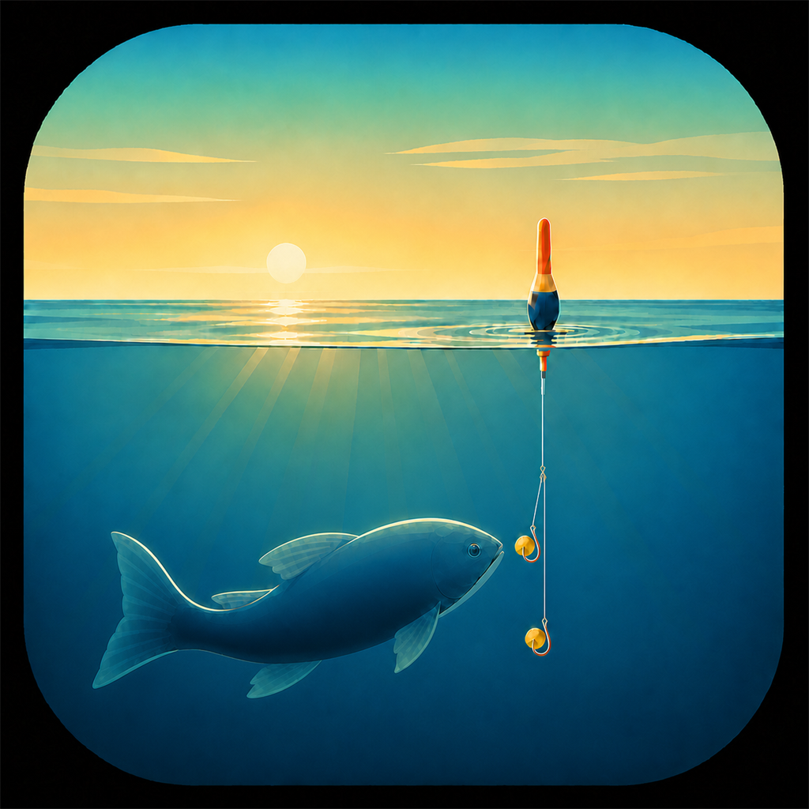
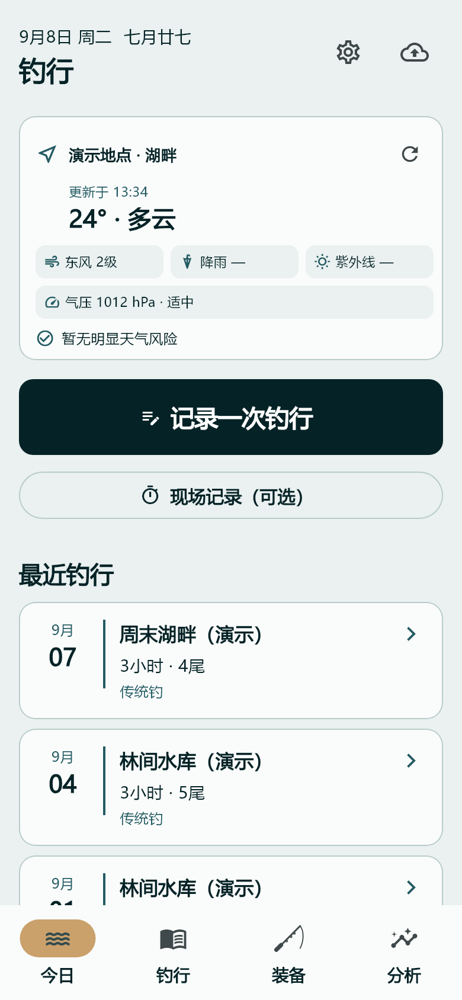
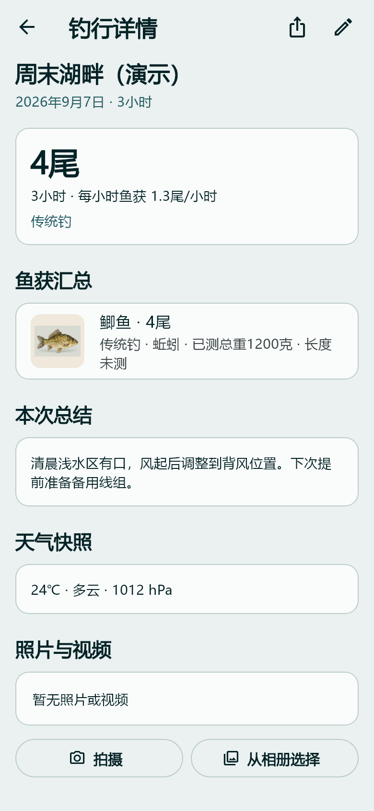
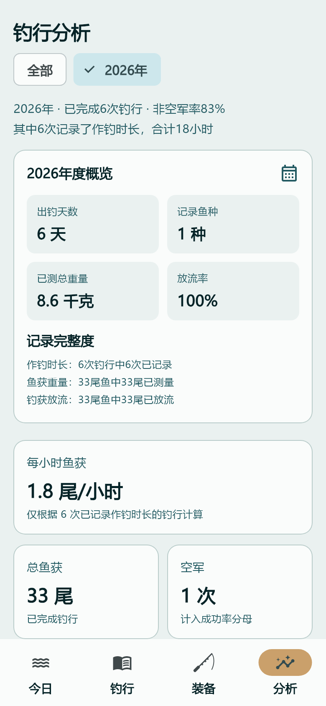

<h1 align="center">钓行</h1>

<strong>记录每一次出钓，留下鱼获，也留下经验。</strong>

Android · 本地优先 · 离线记录

<a href="https://github.com/yaoyouzhong/fishing-app-releases/releases/latest">下载安装</a> · <a href="GUIDE.md">使用指南</a> · <a href="https://github.com/yaoyouzhong/fishing-app-releases/issues">问题反馈</a>

钓行是一款个人钓行档案与经验复盘工具。回家后补记一次出钓，将鱼获、照片、装备和复盘保存在一起；空军同样值得留下一份记录。基础记录无需注册账号，也无需填写 API Key。

## 看看实际界面

| 记录从这里开始 | 一次钓行，一份档案 | 从历史中回顾经验 |
| :---: | :---: | :---: |
|  |  |  |

截图由真实应用界面使用虚构演示数据渲染；不包含用户真实位置、照片或档案。字体与设备显示可能略有差异。

## 为每一次出钓留下什么

- **回家再记，也很完整。** 默认补记已结束的钓行，按鱼种汇总数量和重量，不要求全程计时或逐尾拍照；现场记录为可选入口。
- **鱼获之外，也记过程。** 照片、视频、同行者、装备快照、复盘和遗憾放在同一份档案中。
- **回顾有样本，有时长。** 按年份、月份、钓点、鱼种和钓法查看统计；每小时鱼获只使用有有效时长的样本，空军纳入统计。
- **资料留在本机。** 离线可记录，可导出包含档案和媒体的完整 ZIP 备份；分享默认隐藏钓点，并清除分享媒体的定位元数据。

## 下载与开始使用

1. 在 [最新发布](https://github.com/yaoyouzhong/fishing-app-releases/releases/latest) 下载名称包含 `arm64-v8a` 的 `.apk`，适用于 ARM64 Android 手机。按系统提示允许当前下载来源安装。
2. 打开 App，点击 **记录一次钓行**。填写钓点和日期，补充鱼获与复盘后保存；无鱼获也可以保存。
3. 从首页 **档案备份** 导出第一份完整备份，保存到应用之外。

从旧版升级前建议先备份，再覆盖安装。不要先卸载旧版；卸载会移除应用本地数据。安装包的 SHA-256 在同一 Release 的 `SHA256SUMS.txt` 中提供。

## 哪些功能需要配置

| 功能 | 使用条件 |
| --- | --- |
| 钓行、鱼获、复盘、历史、统计、装备 | 离线可用，无需账号或 Key |
| 照片、视频 | 按系统提示拍摄或选择媒体 |
| 当前天气 | 联网并允许定位；默认 Open-Meteo，无需填写天气 Key |
| 历史天气 | 钓点有坐标并联网查询，也可手工填写 |
| 高德地图与地点搜索 | 同意地图隐私提示并联网，安装包已配置平台 Key |
| 官方渔轮目录更新 | 联网更新，无需用户配置服务账号 |
| 内置线杯兼容资料 | 离线可查；达亿瓦为已审核限定范围，未覆盖不等于不兼容 |
| AI 识鱼 | 可选；在“运行配置”填写兼容的多模态模型服务地址、模型名和 API Key，并自行承担服务用量 |
| 和风天气 | 可选高级配置；不配置时仍使用默认天气服务 |

天气、地图或网络失败不会阻断记录。AI 候选需人工确认，天气关联不代表鱼情因果。

## 数据与隐私

档案保存在本机，目前没有账号云同步。卸载、丢失手机或清空数据前，应先导出备份；恢复只允许导入空档案。备份不包含模型 API Key 或和风私钥，换机后需要重新配置可选服务。

精确钓点默认私密。系统分享默认使用“私密钓点”，用户可自行选择分享内容。使用定位、地图、天气或 AI 识鱼时，所需的位置查询或图片会发送给对应服务；详见 [使用与数据说明](GUIDE.md)。

## 项目与反馈

首版支持 Android，iOS 与 HarmonyOS 暂未发布。本仓库用于安装包分发、使用说明和问题反馈，不包含应用源码。

请在 [Issues](https://github.com/yaoyouzhong/fishing-app-releases/issues) 描述手机型号、Android 版本、App 版本和复现步骤。请勿公开真实钓点、个人备份或 API Key。
